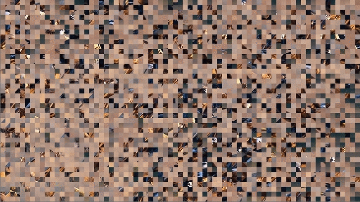

<!-- PROJECT LOGO -->
 

  
1
  <h3 align="center">Sorting Algorithms Visualizers</h3>

  

    A collection of programs to cut up an input image into a grid of squares, shuffle those squares, then sort them using a different sorting algorithm each time.
     
  

<!-- ABOUT THE PROJECT -->
## About The Project

Just some random project idea that came through my mind during quarantine. It's written in Java using the Processing framework

### Built With

* [Java]
  * [Processing]

<!-- GETTING STARTED -->
## Getting Started

The easiest way to get the project up and running is to use Eclipse. You will also need to add Processing as an external JAR to the project.

<!-- CONTACT -->
## Contact

Younes Rouabhia - younesrouabhia@gmail.com

Project Link: [https://github.com/younesyu/sorting_algorithms_visualizers](https://github.com/younesyu/sorting_algorithms_visualizers)

